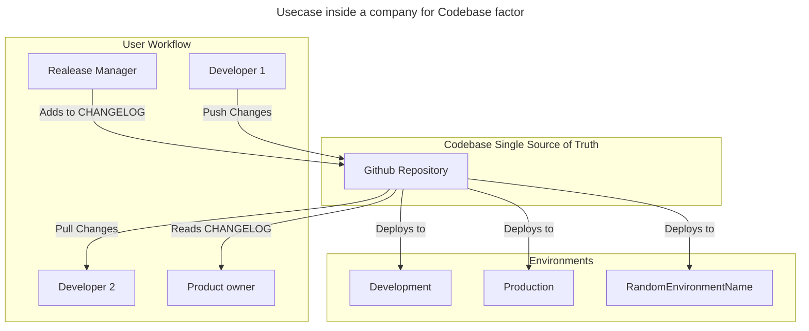
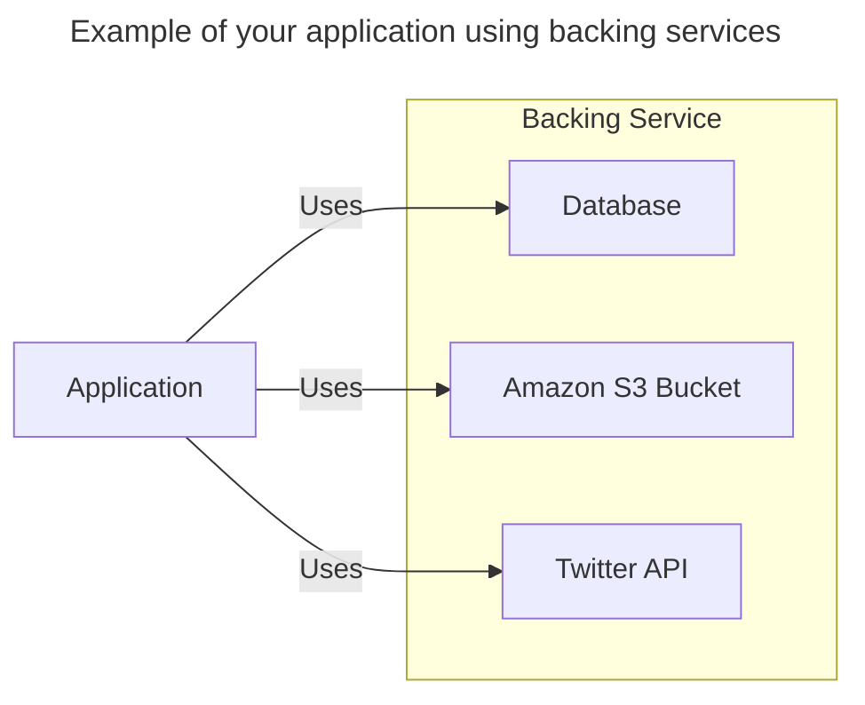
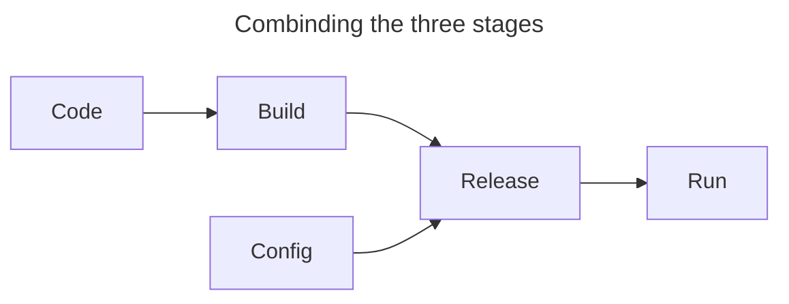
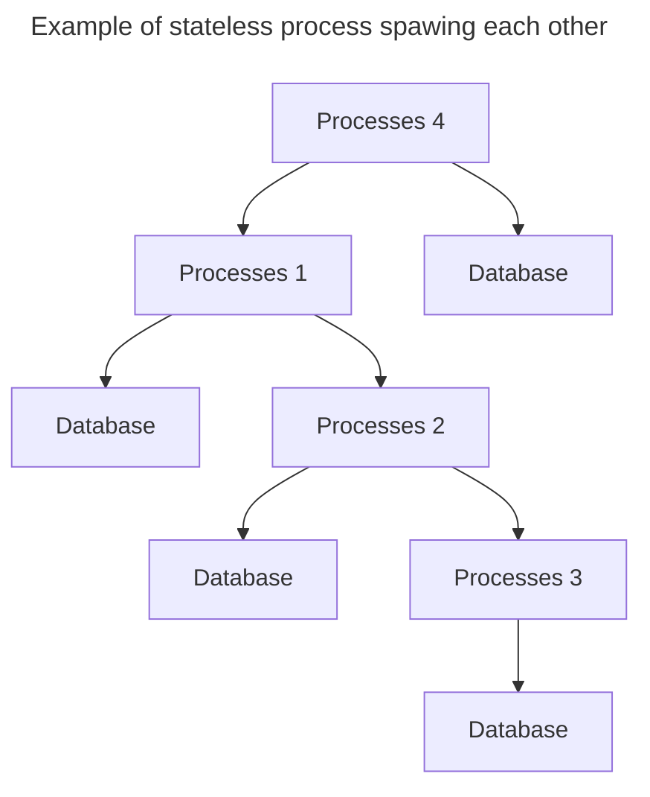
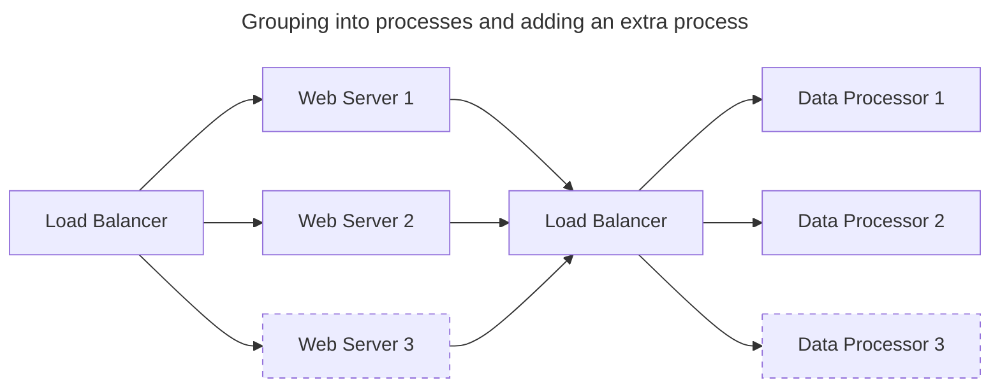

## Introduction to the Twelve-Factor App

The Twlve-Factor App is considered a methodology. It is also called the 12-factor microservice design principles or the 12-factor principles of microservices.

This methodology is a blueprint for building portable, robust, and scalable SaaS applications. Using the approach, businesses can build apps that offer a positive user experience.

It came around 2011 from the developers at Heroko, a platform as a service (PaaS) company, which realized that they were seeing web applications being developed again and again with the same fundamental flaws.

The created methodology to resolve this systematic problem should result in a build process that: [^source-12-factor]

* Use declarative formats for setup automation, to minimize time and cost for new developers joining the project;
* Have a clean contract with the underlying operating system, offering maximum portability between execution environments;
* Are suitable for deployment on modern cloud platforms, obviating the need for servers and systems administration;
* Minimize divergence between development and production, enabling continuous deployment for maximum agility;
* And can scale up without significant changes to tooling, architecture, or development practices.

When originally published the methodology was not highly appreciated. With time the engineers better understood, and felt the pains, of the complexity of cloud native development this has changed. The methodology is not relevant 12 years later, but its properties have started to be cited as the minimum for any service to be cloud native.

Let us examine the factors, and discuss them in modern context next.

## Understanding the twelve factors of the Twelve-Factor App Methodology

It is important to mention, that these factors could be used when building any software, on premice or cloud; monolith or microservice, in any language.
They could be summarised by the following picture:


### Factor 1 - Codebase

> One codebase tracked in revision control, many deploys. [^source-factor-codebase]

This advice was written when things like Github were just starting to become the standard. It wasn't commonplace to assume code was being versioned. It was actually quite common to work on the server that currently hosts your application and to copy/paste, and rename files with suffixes like v2, v3, final etc.
Hence the advice that for any given service, there should be exactly one codebase that's used to produce any number of deployments to any number of environments - local included, was spot on.





### Factor 2 - Dependencies

> Explicitly declare and isolate dependencies [^source-factor-dependencies]

The idea is that for any given version of the codebase, regardless of your package system manager, the result should be something we can determine, meaning the command ```<package_manager_name> install```  should always create the same results. 

So how do we ensure that that happens? In the physical world, if we want to do some tasks, and do not forget to do them - we can create a to-do list. In this list we would describe all the tasks, and when we have to do them e.g. Sunday - Clean kitchen. It is the same in the software world. We can create a list of all our dependencies (manifest), save it in a file, and mention which version we are using against every dependency. This would mean we explicitly declare them, and we isolate them so they can be upgraded independently of the main source code. 

The final result? Our application can be reproduced/rebuilt with consistency and accuracy. Furthermore, build tools like Bazel have taken it further to create reproducible releases (deployments). 

```json
{
  "name": "example-dependancy-manifest",
  "version": "1.2.0",
  "devDependencies": {
    "gulp": "^4.0.2",
    "gulp-uglify": "^3.0.2",
    "uglify-js": "^3.14.3"
  }
}
```

### Factor 3 - Configuration

> Store config in the environment [^source-factor-configuration]

Configuration - anything that's likely to vary between environments (local development, development, staging, production) - should always be clearly separated from the code. Under no circumstances should an application's configuration be baked into the source code. The benefit of keeping the configuration settings separate from application logic is that you can apply configuration settings according to the deployment environment you are in.

To combat this, we could deploy what we have learned from Factor 2 and create a configuration file - of them in YAML format. If we DO NOT check it into the repository, then we have to transfer that file between engineers (software and release). If we do check it in we have to do some acrobatics for the different environments, often resulting in having multiple files like ```config.local```; ```config.dev```; ```config.prod``` etc. And not to mention, how do we even handle sensitive information like passwords? We obviously do not want to check our production passwords in the repository.

The recommendation is to try to store the configuration as an environment variables. Using environmental variables has a few advantages:

* They are standard regarding the operating system our app runs on.
* They are easy to change between deployments, without changing any code
* It is very easy to inject them in containers (Docker)

For example, during local development, I use software called [direnv](https://direnv.net/). I create a file ```.envrc``` and I define my values like:

```bash
export APP_URL=http://localhost:3001
export DB_HOST_URL=http://localhost:5432
```

then if I want to connect to my production database all I need to do is update my file as follows:

```bash
export APP_URL=http://localhost:3001
export DB_HOST_URL=https://product-database-url.com:5432
```

### Factor 4 - Backing services

> Treat Backing Services as Attached Resources [^source-factor-backing-services]

This principle encourages architects to treat external components such as databases, email servers, message brokers, and independent services that can be provisioned and maintained by systems personnel as attached resources. A service should make no distinction between a backing service managed by the same organization or a remote service managed by a third-party vendor.

The idea of being able to attach/detach these services is the ability to be done during deployments. For example, suppose an app’s database is not working correctly due to any issue. In that case, the developer should be able to spin up a new database server restored from a recent backup without any code changes.



### Factor 5 - Build, Release, Run

> Strictly separate build and run stages [^source-factor-brr]

This principle breaks the deployment process into three replicable stages that can be initiated at any time. The logic behind this is that if replicability is possible, then, if necessary (heaven forbid), we could precisely recreate a deployment, in case rolling back to an earlier version becomes necessary.

- **Build:**
  - **Description:** During the Build stage, the source code is transformed into executable code. This involves compiling, processing assets, and preparing the app for deployment. Dependencies are fetched and integrated.
  - **Outcome:** The result of the Build stage is a compiled and ready-to-deploy version of the app, stored in an artifact repository such as Docker Hub or a Maven repository

- **Release:**
  - **Description:** In the Release stage, the app is combined with its specific configuration. Configuration settings, like environment variables, are applied to the app. This creates a release that's ready to be executed in different environments.
  - **Outcome:** A release is a version of the app that's configured for a specific environment. It's ready to be run without any further code changes.

- **Run:**
  - **Description:** During the Run stage, the app is executed based on the release configuration. This is where the app comes to life and serves its intended purpose.
  - **Outcome:** The app is up and running in its intended environment.



### Factor 6 - Process

> Execute the app as one or more stateless processes [^source-12-processes]

Services processes should be stateless and share nothing. This means that no single process keeps track of the state of another process and that no process keeps track of information such as session or workflow status. Any data that has to be persisted should be stored in a stateful backing service i.e. Database, Cache, etc.

A stateless process makes scaling easier. When a process is stateless, instances can be added and removed to address a particular load burden at a given point in time. 



### Factor 7 - Service Isolation

> Each services manages only it's own eco-system. And it exposes a contract for using it.

The actual title of the seventh section of the twelve-factor app is "Port Binding"[^source-12-binding], and it is summarized as "export services via port binding". From a historical perspective, time-wise this made sense. But I feel like it obscures its main point, each service should be self-sufficient, regarding the data and other services it needs. And it should only share that data or other services via its own defined contract (API).

An example, that is more clear, would be hosting "some static HTML website". In a case like this, you would not create your application in a matter where it is dependant that the host service has an existing webserver installed. Quite the opposite you would "bake" everything in, meaning it would not require anything extra for the execution of the application, which is not already present. The application would export HTTP, hence the static HTML files, as a service by binding to a port and listening to incoming requests.

### Factor 8 - Concurrency

> Scale out via the process model [^source-12-concurrency]

You should be able to deploy more copies of the application instead of making the app larger. Meaning services should be able to scale horizontally by adding more instances. The advice given by the methodology is that the application should organize each process according to its purpose. Or in different words, the engineers can achieve this through the separation of those processes into different groups.



### Factor 9 - Disposability

> Maximize robustness with fast startup and graceful shutdown[^source-12-disposability]

This would later be popularised as the phrase "treat your server as cattle, not pets"[^source-pets-vs-cattle] meaning, you should be able to "slaughter them" or in other words destroy and re-deploy them.

In a cloud environment compute resources may become scarce and unavailable, and applications should hence be able to quickly shut down, and quickly boot up. It is an essential element that I often see overlooked until the system requires it. A classic example is the application ignoring a ```SIGTERM``` signal from the OS/Container and eventually said OS/Container having to shut it down forcefully. So to maximize the robustness of your service, examine how to achieve fast startup and graceful shutdown.

### Factor 10 - Dev/Prod Parity

> Keep development, staging, and production as similar as possible[^source-12-dev-prod-parity]

The methodology suggests that an app’s development, staging, and production environment should be as similar as possible to ensure that anyone can understand and release it. So we, as engineers, must make an effort to keep the differences between the environments as small as possible. The methodology discusses the following divergences, which we should aim to minimise.

* **Code divergence** - A developer can write and deploy code hours or just a few minutes later.
* **Stack divergence** - The tools used for development and production environment should be as similar as possible.
* **Personnel divergence** - Developers or owners of the code should be closely involved in deploying it.

### Factor 11 - Logs

> Treat logs as event streams [^source-12-logs]

Good logging can greatly simplify the task of locating and diagnosing misbehaviour of the application, hence providing visibility of those logs is incredibly useful.

Nowadays that may sound a bit strange, but in historical context logs were a "file" located on the virtual machine, that rotated over time. A developer may choose to look at them, but in most of the cases, they were not doing anything proactively. So the idea of treating logs as a service with a never-ending stream of events, to which we can react proactively was revolutionary. Today using Elasticsearch, Logstash and Kibana (ELK) for log analysis or data warehouse, and standards such as OTEL is pretty much the norm. 

### Factor 12 - Administrative Processes

> Run admin/management tasks as one-off processes [^source-12-admin]

While this factor isn't concerned with application development, it pertains to application management. As per this guideline, applications ought to execute management or administrative functions within the same environment as their regular, persistent processes. It recommends employing the built-in tools of the execution environment to run these scripts on the production server. 

This is perhaps the factor that shows most of its age. It advocates not only for shelling into an environment but also for doing manual work in it by running scripts. This will inevitably result in the creation of *snowflake servers*. 

> Snowflake servers are the servers whose actual configuration has drifted far more than what was actually required. These servers can cause big issues as there can be scenarios in which you may want to replace the server and you are not aware of what makes this server still serving and you properly launched a new server is not running the workload you want to run. [^source-snowflakes]

If we move past the initial meaning, we can essentially distil this point to:

* Administrative jobs like database migrations, should be run as a short-lived process.
* Any change to your execution environment, should be done by modifying the environment construction/configuration scripts.


## Summary
The Twelve-Factor App methodology is as relevant and important as ever in the quickly expanding field of software development, particularly in the context of cloud-native applications. The value of this methodology is emphasized further by its alignment with the concepts and needs of current software architecture, emphasizing scalability, maintainability, and resilience in an era when cloud computing has become the basis of technological innovation. Combining this with the ability to connect neatly with the principles of microservices, containerization, and continuous delivery in the cloud-native landscape where applications must be quick to change.


[^source-12-factor]: [12factor.net](https://12factor.net/)
[^source-factor-codebase]: [12factor.net/codebase](https://12factor.net/codebase)
[^source-factor-dependencies]: [12factor.net/dependencies](https://12factor.net/dependencies)
[^source-factor-configuration]: [12factor.net/config](https://12factor.net/config)
[^source-factor-backing-services]: [12factor.net/backing-services](https://12factor.net/backing-services)
[^source-factor-brr]: [12factor.net/build-release-run](https://12factor.net/build-release-run)
[^source-factor-processes]: [12factor.net/processes](https://12factor.net/processes)
[^source-12-binding]: [12factor.net/port-binding](https://12factor.net/port-binding)
[^source-12-concurrency]: [12factor.net/concurrency](https://12factor.net/concurrency)
[^source-12-disposability]: [12factor.net/disposability](https://12factor.net/disposability)
[^source-12-dev-prod-parity]: [12factor.net/dev-prod-parity](https://12factor.net/dev-prod-parity)
[^source-12-logs]: [12factor.net/logs](https://12factor.net/logs)
[^source-12-admin]: [12factor.net/admin-processes](https://12factor.net/admin-processes)
[^source-pets-vs-cattle]: [The History of Pets vs Cattle and How to Use the Analogy Properly](https://cloudscaling.com/blog/cloud-computing/the-history-of-pets-vs-cattle/)
[^source-snowflakes]: [What are the snowflake servers?](https://www.learnsteps.com/what-are-snowflake-servers/)

