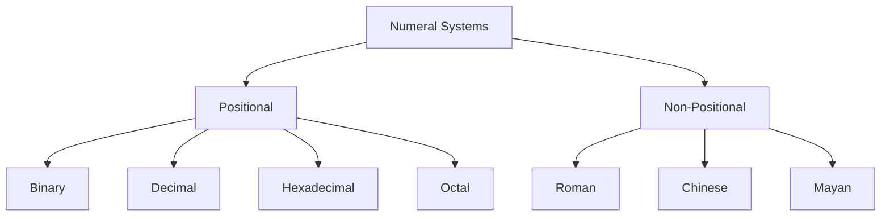
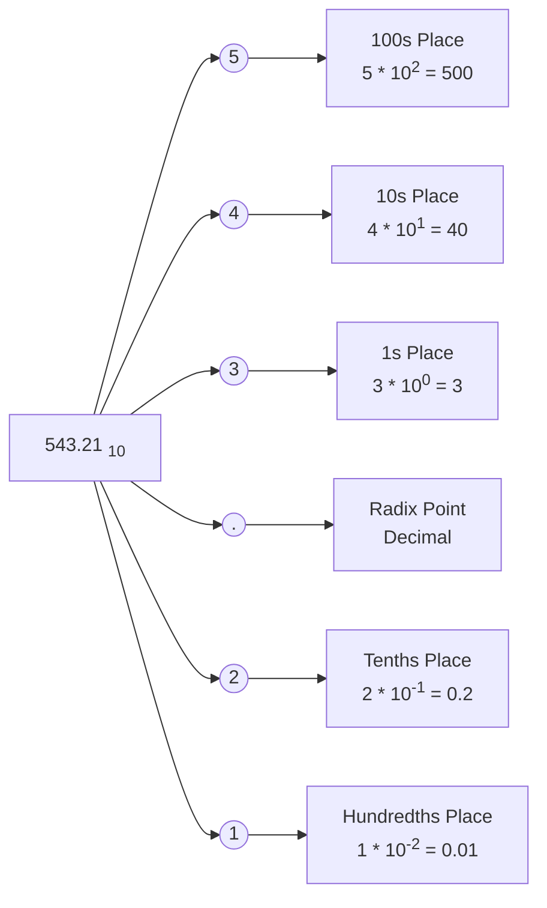

# Numeral systems

## What are numeral systems?

Numeral systems are a method for representing (recording) numbers through a finite set of graphical characters called digits. Along with these characters, rules for representing numbers must also be included. The symbols used in representing numbers in a given numeral system can be thought of as its **alphabet**.

Throughout the various stages of human development, different numeral systems have gained prominence. The earliest numerical systems were developed by ancient civilizations such as the Babylonians and Egyptians, who used symbols to represent numbers. It should be noted that today, the Arabic numeral system has become the most widespread. It uses the digits 0, 1, 2, 3, 4, 5, 6, 7, 8, and 9 as its alphabet. (It's interesting to note that the writing of Arabic numerals today differs from the ten digits presented above, but nevertheless, they still refer to the same numeral system, i.e., the decimal system).

Besides an alphabet, every numeral system also has a **base**. The base is a number equal to the number of different digits used by the system to record numbers within it. For example, the Arabic numeral system is decimal because it has 10 digits. The base can be any number, whose absolute value must be different from 0 and 1. It can also be a real or complex number with a sign.

## Positional and non positional numeral systems



A commonly cited example of a non-positional numeral system is the Roman numeral system. In this system, numbers are represented by combining letters from the Latin alphabet, where each letter corresponds to a specific integer value.

| Roman Numeral | Decimal Value |
|---------------|---------------|
| I             | 1             |
| V             | 5             |
| X             | 10            |
| L             | 50            |
| C             | 100           |
| D             | 500           |
| M             | 1000          |

So let us represent the number 39 in Roman, that would be

$$
39 = XXX + IX = XXXIX.
$$

In this numeral system, the position of the digit does not matter for the value of the number, but the following rules are applied to determine its value:

* If two consecutively written Roman numerals are arranged such that the value of the first is greater than or equal to the value of the second, then their values are added together. For example:
The number III equals 3, and the number MMD equals 2500.

* If two consecutively written Roman numerals are in decreasing order of their values, then their values are subtracted. For example:
The number IX equals 9.


On the opposite end, when talking about positional system, this is when the place (position) of the digits matters for the value of the number. This means that the value of a digit in a number is not strictly defined and depends on which position the digit occupies in the number. For example, in the number 351, the digit 1 has a value of 1, while in the number 1024, it has a value of 1000. It should be noted that the *bases of numeral systems are applied only in positional numeral systems*.

$$
A(p) = a(n) \cdot p^n + a(n-1) \cdot p^{n-1} + \ldots + a(0) \cdot p^0 + a(-1) \cdot p^{-1} + a(-2) \cdot p^{-2} + \ldots + a(-k) \cdot p^{-k} 
$$

Where:

* ( $$ A(p) $$ ) is the value of the number in the positional numeral system with base ( p ).
* ( $$ a(i) $$ ) are the digits of the number at position ( i ).
* ( $$ n $$ ) is the position of the most significant digit (the leftmost non-zero digit).
* ( $$ k $$ ) is the number of digits after the radix point (decimal point).
* ( $$ p^n, p^{n-1}, \ldots, p^0, p^{-1}, p^{-2}, \ldots, p^{-k} $$ ) are the positional weights of the digits, determined by the base ( p ) raised to the power of their respective positions ( i ).

The formula might seem complex at first glance, but it's actually something we work with all the time. To illustrate, let's take an example from the decimal numeral system, which is also called the Base 10 system.



In the field of computer science, the numeral systems that are most commonly utilized are the binary, decimal, and hexadecimal systems. These can alternatively be referred to as positional systems with bases of 2, 10, and 16, respectively.

## Quick table comparison Decimal, Binary and Hexadecimal

> The hexadecimal system requires 16 unique symbols to represent its values, so it combines the digits 0 through 9 with the first six letters of the alphabet: a, b, c, d, e, and f.
> 
> The decimal system, on the other hand, uses a set of 10 symbols, which are the digits 0 through 9.
> 
> Lastly, the binary system uses just two symbols in its alphabet: 0 and 1.
{: .prompt-info }

This means that comparing the 15 digits in each system is trivial:

| Decimal | Binary    | Hexadecimal |
|---------|-----------|-------------|
| 0       | 0000      | 0           |
| 1       | 0001      | 1           |
| 2       | 0010      | 2           |
| 3       | 0011      | 3           |
| 4       | 0100      | 4           |
| 5       | 0101      | 5           |
| 6       | 0110      | 6           |
| 7       | 0111      | 7           |
| 8       | 1000      | 8           |
| 9       | 1001      | 9           |
| 10      | 1010      | A           |
| 11      | 1011      | B           |
| 12      | 1100      | C           |
| 13      | 1101      | D           |
| 14      | 1110      | E           |
| 15      | 1111      | F           |


The complex the number becomes, the more interesting is the comparison.


| Base (System)       | Value              | Base and Position = Value | Representation of 17 |
|---------------------|--------------------|-------------------------|----------------------|
| Decimal (Base 10)   | Ones               | 10<sup>0</sup> (1)      | 7 * 10<sup>0</sup> (7) |
|                     | Tens               | 10<sup>1</sup> (10)     | 1 * 10<sup>1</sup> (10) |
|                     | Hundreds           | 10<sup>2</sup> (100)    |  |
|                     | Thousands          | 10<sup>3</sup> (1,000)  |  |
|                     | Ten Thousands      | 10<sup>4</sup> (10,000) |  |
|                     | Hundred Thousands  | 10<sup>5</sup> (100,000)|  |
|                     | Millions           | 10<sup>6</sup> (1,000,000)|  |
|                     | Ten Millions       | 10<sup>7</sup> (10,000,000)|  |
|
| Binary (Base 2)     | Ones               | 2<sup>0</sup> (1)       | 1 * 2<sup>0</sup> (1) |
|                     | Twos               | 2<sup>1</sup> (2)       | 0 * 2<sup>1</sup> (0) |
|                     | Fours              | 2<sup>2</sup> (4)       | 0 * 2<sup>2</sup> (0) |
|                     | Eights             | 2<sup>3</sup> (8)       | 0 * 2<sup>3</sup> (0) |
|                     | Sixteens           | 2<sup>4</sup> (16)      | 1 * 2<sup>4</sup> (16) |
|                     | Thirty-Twos        | 2<sup>5</sup> (32)      | |
|                     | Sixty-Fours        | 2<sup>6</sup> (64)      | |
|                     | ...                | 2<sup>7</sup> (128)     | |
|
| Hexadecimal (Base 16)| Ones              | 16<sup>0</sup> (1)      | 1 * 16<sup>0</sup> (1) |
|                     | Sixteens           | 16<sup>1</sup> (16)     | 1 * 16<sup>1</sup> (16) |
|                     | Two Hundred<br> Fifty-Sixs| 16<sup>2</sup> (256) |  |
|                     | Four Thousand<br> Ninety-Sixs| 16<sup>3</sup> (4,096)|  |
|                     | ... | 16<sup>4</sup> (65,536) |  |
|                     | ... | 16<sup>5</sup> (1,048,576) |  |
|                     | ... | 16<sup>6</sup> (16,777,216) |  |
|                     | ... | 16<sup>7</sup> (268,435,456) |  |


## Binary

### Binary with details

Numbers in the binary numeral system are set in a form that is convenient for the computational machine to interpret. This form can be a bit more difficult for humans to understand. The binary numeral system, which has a base of 2, is used to represent binary numbers. Only the digits 0 and 1 are used for their representation.

It is customary when a number is written in a numeral system other than the decimal system to reflect which numeral system was used for its representation by an index at the bottom of it. For example, the notation $$1110_{(2)}$$ denotes a number in the binary numeral system. If not explicitly indicated, the numeral system is assumed to be decimal. The number is pronounced by reading its digits sequentially from left to right (i.e., we read it from the most significant to the least significant "bit").

If the number is 8-bit, the powers reach up to the seventh $$(2^7=128)$$. If the number is 16-bit, the powers reach up to the fifteenth $$(2^{15}=32768)$$. Through 8 binary digits (0 or 1), a total of 256 numbers can be represented because $$(2^8=256)$$. Through 16 binary digits, a total of 65536 numbers can be represented because $$(2^{16}=65536)$$.

Take the decimal number 148. It is composed of three digits: 1, 4, and 8, and corresponds to the following binary number: $$10010100_{(2)}$$

$$148 = (1×2^7) + (1×2^4) + (1×2^2) $$

| Number | 1 | 0 | 0 | 1 | 0 | 1 | 0 | 0 |
|--------|---|---|---|---|---|---|---|---|
| Power  | 2<sup>7</sup> | 2<sup>6</sup> | 2<sup>5</sup> | 2<sup>4</sup> | 2<sup>3</sup> | 2<sup>2</sup> | 2<sup>1</sup> | 2<sup>0</sup> |
| Value  | 1×2<sup>7</sup> = 128 | 0×2<sup>6</sup> = 0 | 0×2<sup>5</sup> = 0 | 1×2<sup>4</sup> = 16 | 0×2<sup>3</sup> = 0 | 1×2<sup>2</sup> = 4 | 0×2<sup>1</sup> = 0 | 0×2<sup>0</sup> = 0 |

### Converting from Binary to Decimal

When converting from the binary to the decimal numeral system, the binary number is transformed into a decimal one. Any number can be converted from one numeral system to another by performing a sequence of operations that are possible in both numeral systems. As we already mentioned, numbers written in the binary numeral system consist of binary digits that are arranged by the powers of two. Let's take the number $$11001_{(2)}$$ as an example. Its transformation into decimal is performed by calculating the following sum:

Write out the calculation by multiplying each binary digit by ( 2 ) raised to the power of its position, starting from the right with position 0:

$$ ( 11001_{(2)} = 1 \times 2^4 + 1 \times 2^3 + 0 \times 2^2 + 0 \times 2^1 + 1 \times 2^0 ) $$

Perform the multiplication for each term:

$$ ( = 1 \times 16 + 1 \times 8 + 0 \times 4 + 0 \times 2 + 1 \times 1 ) $$

Simplify the expression by evaluating each term:

$$ ( = 16 + 8 + 0 + 0 + 1 ) $$

Add the values together to get the decimal equivalent:

$$ ( = 25 ) $$

So, $$ ( 11001_{(2)} = 25_{(10)} ) $$ 

In other words, each binary digit is multiplied by 2 raised to the power of its position in the binary number. Finally, the numbers obtained for each of the binary digits are added together to obtain the decimal equivalent of the binary number.

There is also another method of conversion known as the Horner scheme. In this scheme, the leftmost digit is multiplied by two and added to its right neighbor. This result is multiplied by two and the next neighboring digit from the number (the digit to the right) is added. This continues until all the digits in the number are exhausted, with the last digit of the number being added without multiplication. Here's an example, where we'll convert the binary number $$( 1001_{(2)} )$$ to decimal using the Horner scheme.

Start with the leftmost digit and multiply it by 2, then add the next digit:

$$ ( (1 \times 2 + 0) = 2 ) $$

Take the result and multiply by 2, then add the next digit:

$$ ( (2 \times 2 + 0) = 4 ) $$

Repeat the process until you've included all digits:

$$ ( (4 \times 2 + 1) = 9 ) $$

This can be simplified to $$ 1001_{(2)} = ((1 \times 2 + 0) \times 2 + 0) \times 2 + 1 = 2 \times 2 \times 2 + 1 = 9_{(10)} $$

So, $$( 1001_{(2)} = 9_{(10)})$$ .


### Converting from Decimal to Binary.

This is done by dividing the decimal number by two repeatedly and keeping track of the remainders. These remainders, which will only be zeros and ones, are then used to write the converted number. The division continues until a quotient of zero is obtained. Let's use the number 148 as an example. It is divided by the base to which we are converting (in this example, it is 2). Then, from the remainders obtained in the division (which are only zeros and ones), the converted number is written. The division is carried out until we get a quotient of zero.

$$
\\
\begin{aligned}
148 \div 2 &= 74 & \text{remainder} \; 0; \\
74 \div 2 &= 37 & \text{remainder} \; 0; \\
37 \div 2 &= 18 & \text{remainder} \; 1; \\
18 \div 2 &= 9 & \text{remainder} \; 0; \\
9 \div 2 &= 4 & \text{remainder} \; 1; \\
4 \div 2 &= 2 & \text{remainder} \; 0; \\
2 \div 2 &= 1 & \text{remainder} \; 0; \\
1 \div 2 &= 0 & \text{remainder} \; 1; \\
\end{aligned}
$$

After the division is complete, we write down the values of the remainders in the reverse order of their occurrence, as follows:

$$[ 10010100_{(2)} ]$$

Therefore, $$( 148_{(10)} )$$ in decimal is equal to $$( 10010100_{(2)} )$$ in binary.

## Hexidecimal

### Hexidecimal with details

In hexadecimal numbers, we use the number 16 as the base of the numeral system, which requires the use of 16 symbols (digits) to represent all possible values from 0 to 15 inclusive. As already shown in one of the tables in previous sections, the numbers from 0 to 9 and the Latin letters from A to F are used to represent hexadecimal numbers. Each of them has the corresponding value:
$$[ A = 10, B = 11, C = 12, D = 13, E = 14, F = 15 ]$$

Examples of hexadecimal numbers include, respectively, D2, 1F2F1, D1E, and others.


### Converting from Hexidecimal to Decimal

To convert to the decimal system, multiply by (16^0) the value of the rightmost digit, by (16^1) the next digit to the left, by (16^2) the next digit to the left, and so on, and then add them together. For example:

$$
\\
\begin{aligned}
D1E_{(16)} &= D \times 16^2 + 1 \times 16^1 + E \times 16^0 \\
&= 13 \times 256 + 1 \times 16 + 14 \times 1 \\
&= 3358_{(10)}
\end{aligned}
$$

### Converting from Decimal to Hexidecimal
To convert from decimal to hexadecimal, divide the decimal number by 16 and take the remainders in reverse order. For example:

$$ 
\\
\begin{aligned}
3358 \div 16 &= 209 & \text{remainder} \; 14 \; (E); \\
209 \div 16 &= 13 & \text{remainder} \; 1 \; (1); \\
13 \div 16 &= 0 & \text{remainder} \; 13 \; (D);
\end{aligned}
$$

Take the remainders in reverse order to get the number $$( D1E_{(16)} )$$.

# Representing data in the computer

We won't go much in details about memory storage and use. In short it is Binary that is used to store data in the computer. Depending on the type of data we want to store (strings, integers or real numbers with an integral and fractal part) information is represented in a particular manner. It is determined by the data type.

A bit is the smallest slice of memory pie, with only two possible flavors: 0 or 1. Alone, a bit can't do much, but get eight of them together, and you've got yourself a byte—a tiny team that can represent anything from a single character to a pixel's color.

Lastly machine word, which is just a fancy way of saying a bunch of bytes stuck together. Depending on the task at hand, a machine word might be made up of 2, 4, or even 8 bytes.

## Integers in Memory, Signed and Unsigned
How integers hang out in a computer's memory? One key detail is whether they carry a sign. Integers can be stored either way: with a sign (**signed**) or without (**unsigned**). Signed integers get a special bit, the most significant one, which is 1 for negative numbers and 0 for positives. The other bits? They just tell us the number's value. But for unsigned integers, every single bit is all about the number's value.

Unsigned integers get 1, 2, 4, or 8 bytes of space. The more bytes, the bigger the range of numbers we can store. With ( n ) bits, you can cover integers from $$( [0, 2^n - 1] )$$. Check out the unsigned integers ranges based on bytes:

| Bytes | Order                          |  Regular   |
|-------|-------------------------------|-------------------------|
| 1     | 0 &divide; 2<sup>8</sup>        | 0 &divide; 255                |
| 2     | 0 &divide; 2<sup>16</sup>        | 0 &divide; 65,535             |
| 4     | 0 &divide; 2<sup>32</sup>       | 0 &divide; 4,294,967,295      |
| 8     | 0 &divide; 2<sup>64</sup>        | 0 &divide; 18,446,744,073,709,551,615 |

Representing Negative Numbers requires us to use a signed integer.
Negative numbers also take up 1, 2, 4, or 8 bytes, with the leftmost bit giving us the scoop on the sign. If it's a 1, the number's negative; a 0 means it's positive.

Here's the ranges for signed integers:

| Bytes | Order                               | Regular                                    |
|-------|-------------------------------------|--------------------------------------------|
| 1     | -2<sup>7</sup> &divide; 2<sup>7</sup> | -128 &divide; 127                         |
| 2     | -2<sup>15</sup> &divide; 2<sup>15</sup>  | -32,768 &divide; 32,767                   |
| 4     | -2<sup>31</sup> &divide; 2<sup>31</sup> | -2,147,483,648 &divide; 2,147,483,647     |
| 8     | -2<sup>63</sup> &divide; 2<sup>63</sup>| -9,223,372,036,854,775,808 &divide; 9,223,372,036,854,775,807 |

Negative numbers can be encoded in straight, reversed, and complement codes. Positive numbers look the same in all three.

Straight code (signed magnitude) just puts the sign in the highest bit and the absolute value in the rest. Like so:

The number 3 is (00000011), and -3 is (10000011).

Reversed code (one's complement) flips all the bits of straight code. Not so handy for addition and subtraction since it needs special handling.

Complement code (two's complement) takes the reversed code and adds one. For instance, -127 is (1 0000001).

In the Binary Coded Decimal, also known as BCD code, in one byte two decimal digits are recorded. This is achieved by encoding a single decimal digit in each half-byte. Numbers presented in this way can be packed, which means that they can be represented in a packed format. If we represent a single decimal digit in one byte we get a non-packed format.

Modern microprocessors mostly using two's complement for negative numbers.

### Byte Order: Big-Endian vs. Little-Endian
When storing multi-byte integers in a computer's memory, you'll encounter two primary conventions: Big-Endian and Little-Endian. Imagine you have a lineup of bytes; these two approaches dictate the order in which they stand.

* Little-Endian (LE) – It's like reading the address on an envelope from bottom to top. The least significant byte is at the front, and significance grows as you move along the line. This is the format used by Intel's x86 and x64 architectures.

* Big-Endian (BE) – This is like reading a book from the beginning. The most significant byte leads the way, setting the stage for the rest to follow. You'll find this order in PowerPC, SPARC, and ARM architectures.

Let's look at the hexadecimal number $$A8B6EA72_{(16)}$$ and how it's stored in both byte orders:

In Little-Endian, the bytes are arranged from least to most significant:


| 72 | EA | B6 | A8 |


In Big-Endian, the order is reversed, from most to least significant:

| A8 | B6 | EA | 72 |


In Go, you can work with both byte orders using the "encoding/binary" package. This package provides functionality to read and write data in both Little-Endian and Big-Endian by using ` binary.LittleEndian` or `binary.BigEndian`. 

[Try the example](https://go.dev/play/p/19S05YXVJCQ)

```go
number := 0xA8B6EA72

bufLE := new(bytes.Buffer)
binary.Write(bufLE, binary.LittleEndian, uint32(number))

bufBE := new(bytes.Buffer)
binary.Write(bufBE, binary.BigEndian, uint32(number))

fmt.Printf("Little-Endian: % X\n", bufLE.Bytes())
fmt.Printf("Big-Endian: % X\n", bufBE.Bytes())
// Output:
// Little-Endian: 72 EA B6 A8
// Big-Endian: A8 B6 EA 72
```
{: .nolineno }

## Floating points numbers in Memory
Simply put, in the computer world, real numbers with their whole and fractional parts are represented by floating-point numbers. This approach is based on the IEEE 754 Standard, which is widely accepted by major chip makers and used in most programming languages. 

By the IEEE-754 standard, any real number ( R ) can be shown as: $[ R = M \times q^p] $. Here, ( M ) is the mantissa, ( p ) is the exponent, and ( q ) is the base. The mantissa's a fraction between -1 and 1, and the exponent's an integer.

Every floating-point number follows this format: $( \pm 0.M \times q^{\pm p} )$. Using binary, which is base 2, a real number ( R ) looks like $( R = M \times 2^p )$ .The "floating" decimal point in the mantissa gives us a semi-logarithmic format.


Let's look at -21.15625 in a 32-bit single precision format. We use 23 bits for the mantissa, 8 for the exponent, and 1 for the sign. Here's how it breaks down byte wise:

* **Sign (S)**: 1 (because the number is negative)
* **Exponent (p)**: 10000011 (which is 131 in binary, representing 4 after adjusting for the bias)
* **Mantissa (M)**: 01010010100000000000000 (which is the normalized fraction part)

The algorithm to compute the above binary values is:
> 1. Convert to Binary:  21 converts to binary as 10101 and 0.15625 converts to binary as 0.00101 
> 2. Combine the whole number and the fractional part: 10101.00101
> 3. In floating-point representation, numbers are normalized so that there's only one non-zero digit before the decimal point. For our number, we need to shift the binary point four places to the left to normalize it, which gives us $1.010100101$.
> 4. The exponent is calculated by adding the number of places we shifted to the bias. For 32-bit floats, the bias is 127. Since we shifted by 4, the exponent is 4 + 127 = 131. In binary, 131 is 10000011.
> 5. Determine the Mantissa: It's the "010100101" from our normalized number, followed by enough zeros to make up the 23 bits: 01010010100000000000000.
> 6. Sign Bit: Since the number is negative, the sign bit is 1. If it were positive, the sign bit would be 0.
{: .prompt-info }


So now that we have the binary numbers of each of the components we can store the floating point in memory. But how can we go back from those stored values to a real number? We just convert the binary to decimal number. So, the exponent p would be equal to: $p = (2^0 + 2^1 + 2^7) - 127 = (1+2+128) – 127 = 4$ because it is only on positions 0,1, and 7 that the bits are "toggled".

Now let us convert the mantissa to decimal. 

$$ 
\\
\begin{aligned}
M &= 1 + 1 \times 2^{-2} + 1 \times 2^{-5} + 1 \times 2^{-7} + 1 \times 2^{-9} + \ldots \\
&= 1 + 0.25 + 0.03125 + 0.0078125 + 0.001953125 \\
&= 1.322265625
\end{aligned}
$$

One again out from all 23 bits, we only care about the position of the ones that are with value 1.

Substituding the values of the mantissa and exponent in the formula we talked above, we get:

$$[ R = -1,3222656 * 2^4 = -1,322265625 * 16 = -21,1562496 \approx -21,15625 ]$$

[Try the example](https://go.dev/play/p/nXAilX_Ik4T)

```go
num := -21.15625
//Converts to IEEE 754 binary representation using math.Float32bits.
floatBits := math.Float32bits(float32(num))

// 32-bit float, shift 31 to get the sign
sign := (floatBits >> 31)
// Exponent is in bits 24 to 31, shift til 23 bit
// AND with 0xFF (which is 11111111 in binary, or 255 in decimal) to keep only the last 8 bits.
exponent := (floatBits >> 23) & 0xFF
// AND operation with 0x7FFFFF (011111111111111111111111 in binary).
// Mask clears the sign and exponent bits, leaving only the mantissa bits.
mantissa := floatBits & 0x7FFFFF

// Print the components
fmt.Printf("Number: %v\n", num)
fmt.Printf("Sign: %b\n", sign)
fmt.Printf("Exponent: %b\n", exponent)
fmt.Printf("Mantissa: %b\n", mantissa)
// Output:
// Number: -21.15625
// Sign: 1
// Exponent: 10000011
// Mantissa: 1010010100000000000000
```
{: .nolineno }

### Floating point numbers inaccuracies

Handling Big and Tiny Numbers in Go

In computing, we often deal with massive numbers or tiny fractions. The IEEE 754 format shines here, storing a number's size in the exponent and its precision in the mantissa. With 64-bit doubles, you get 15-16 digits of precision and can shift the decimal point up to 300 places!

But beware—not all real numbers fit neatly into IEEE 754. Some, like the seemingly simple 0.1, can't be perfectly represented as a finite sum of powers of two so as a 32-bit floating-point value is presented as 0.099999994. This can lead to rounding errors that stack up, especially in fields like finance where precision is key.

[Take this Go example that mimics adding up a thousand 0.1s:](https://go.dev/play/p/52pF4KUEd2x)

```go
var sum float32 = 0

for i := 0; i < 1000; i++ {
    sum += 0.1
}

fmt.Printf("Sum = %v\n", sum)
// Output something like: 
// Sum = 99.99905
```
{: .nolineno }

## Characters in Memory: ASCII and Encoding Schemes

Remember the first program you ever wrote? Chances are it was the "Hello world" program. 
```fmt.Println("Hello world")```
Text manipulation is a core functions of programming, when discussing text(strings), we are actually discussing characters, because strings are actually arrays of charters. So how do we store them in memory?

Well the short answer to that question is we store it characters as numbers, and then we have encoding schemas (systems) to know which number corresponds to which characters.

One of the earliest and simplest encoding schemes, when it comes to computing, is ASCII (American Standard Code for Information Interchange). It encodes each character as a single byte, but it only has room for 127 characters, which covers the Latin alphabet, some symbols, and special characters. This means ASCII can't handle characters from scripts like Cyrillic or other alphabets such as Arabic, Korean, or Chinese.

Encoding gets more complex and inclusive with UTF-8, which is based on the Unicode standard. Unicode aims to represent characters from all widely used languages and writing systems, including Cyrillic, Latin, Arabic, Chinese, Japanese, Korean, and many more. 

UTF-16 is another Unicode-based encoding that uses 16 bits (2 bytes) for each character, with some of the rarer symbols represented by a pair of these 16-bit values. While UTF-16 is efficient for languages with characters that often fall outside the single-byte encodings, it uses more storage space for languages like English, where most characters could be represented with just one byte in ASCII or UTF-8.

Sounds cool in theory, how does it look in practise?
Here's an example of ASCII:
* The letter 'A' is stored as 65 (in decimal) or 01000001 (in binary).
* The letter 'B' is stored as 66 (in decimal) or 01000010 (in binary).
  
In UTF-8:
* The letter 'A' is still one byte: 65 (decimal) or 01000001 (binary).
* The letter 'ñ' is two bytes: 195 and 177 (in decimal) or 11000011 and 10110001 (in binary).
* The Chinese character '中' is three bytes: 228, 184, and 173 (in decimal) or 11100100, 10111000, and 10101101 (in binary).
* The emoji '😊' is four bytes: 240, 159, 152, 138 (in decimal) or 11110000, 10011111, 10011000, 10001010 (in binary).
  
In UTF=16:
* The letter 'A' is two bytes: 0 and 65 (in decimal) or 00000000 and 01000001 (in binary).
* A less common character like '𐍈' (an ancient letter) needs 4 bytes: 216, 1, 223, 136 (in decimal) or 11011000, 00000001, 11011111, 10001000 (in binary).
* The emoji '😊' is two units of two bytes each (four bytes total): 55357 and 56842 (in decimal) or 11011000, 00111101 and 11011110, 00111010 (in binary).


# Helpful videos

* [Floating Point Numbers - Computerphile](https://www.youtube.com/watch?v=PZRI1IfStY0)
* [Floating Point Numbers (Part1: Fp vs Fixed) - Computerphile](https://www.youtube.com/watch?v=f4ekifyijIg)
* [Introduction to number systems and binary - Pre-Algebra - Khan Academy](https://www.youtube.com/watch?v=ku4KOFQ-bB4)