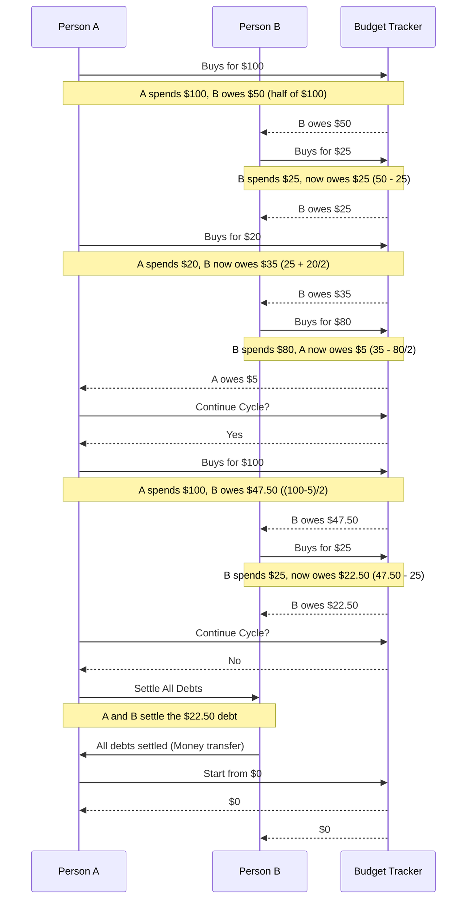

## Introduction, Context and Feature scoping

### Introduction

My fiancée and I had been happily using [Splitwise](https://www.splitwise.com/) to manage our family budget for years. But the latest update has made it nearly unusable: only three entries per day are allowed, and each entry is followed by a 10-second unskippable ad. To bypass these restrictions, you now have to subscribe to the Pro version for $40 a year.

How to solve this?

1. Pay $40
2. Look for other free alternatives
3. Self-host any of the already existing open-source projects
4. ... Literally anything else ...
5. Build your own version of Splitwise, with blackjack and hookers, since it would only take you a weekend anyway

If you picked option 5, you're in the right place.

### Context

Our family doesn't adhere to a conventional shared budget. Instead, we utilize a "`matching expenditure budget`". What does this mean? Instead of establishing a fixed budget and monitoring expenses against it, we track every household expenses and who covered each cost. The essential characteristic of this approach is that both partners aim to balance their spending contributions the total house expenditure, ensuring their net spending is close to zero.

If this sounds complex, it is not, here is graph:

