One of the most critical decisions in backend engineering is choosing between synchronous and asynchronous inter-service communication. 
The right choice isn't about dogma; it's about understanding trade-offs. Getting it wrong can lead to a "distributed monolith" - a system with the complexity of microservices but the tight coupling of a monolith. 
Let's break down when to use each approach to build robust and scalable systems.

## The Case for Simplicity: Start with Synchronous

By default, synchronous architecture is often the right place to start. It’s a simple, predictable request-response model where a client sends a request, then waits for the server to process it and send back a response.

Think of synchronous communication like a direct phone call: you ask a question and wait on the line for the answer. The conversation is immediate and linear. If the other side doesn’t pick up, the call fails.

* **Why it's great**:
	* **Easy to Understand**: The flow is linear and simple to trace. `Service A` calls `Service B` and waits for a response before continuing.
	* **Simple Debugging**: Errors are returned directly in the response, making it easy to pinpoint the source of a failure.
	* **Lower Initial Complexity**: It doesn't require extra infrastructure like message brokers, making it faster to build initially.
* **When it falls short**:
	* When a slow downstream service can cause cascading failures, blocking your entire system.
	* When you need to perform heavy, long-running tasks without making the user wait.

* **Example: Updating a User Profile**
    1. A user changes their name in a web form and clicks "Save."
    2. The frontend sends a synchronous `PUT /api/users/123` request.
    3. The backend validates the data, updates the user's name in the database, and returns a `200 OK` response.
    4. The user sees a "Profile Saved!" message. The operation is atomic and the user expects immediate feedback, making it a perfect synchronous use case.

## The Power of Resilience: When to Go Asynchronous

Asynchronous flows resemble texting or publishing on social media, you put something up, and at some point of time, someone would reply or send a like.
Asynchronous architecture decouples services. Instead of waiting for a direct response, services publish messages or events to a message broker. Other services can then process these messages in the background.

* **Why it's great:**
	* **Improving Scalability and Performance**: Absorb traffic spikes by queuing requests. Your system can process them at its own pace, preventing overload. For example, during a flash sale, you can queue up all incoming orders and process them as fast as you can, rather than dropping requests.
	* **Increasing Resilience**: If a service goes down, messages remain safely in the queue. Once the service is back online, it can resume processing, ensuring no data is lost. This is what the podcast hosts call a "self-healing" system.
	* **Integrating with Unreliable Third-Parties**: Don't let a flaky external API for sending marketing emails break your critical user registration flow. Publish a `UserRegistered` event and let a separate, non-critical service handle the API call.
* **The Challenges of Going Async:**
	* **Eventual Consistency**: Data may not be up-to-date instantly across all services.
	* **Debugging Complexity**: "Where did that message go?" logs, traces, and queue metrics become essential.
	* **Tougher Error Reporting to End Users**: If something fails in the background, the user might not get an immediate status update.
	* **The "Distributed Monolith"**: A common anti-pattern where services are broken apart but remain tightly coupled through synchronous, blocking calls, inheriting the downsides of both monoliths and microservice

## Essential Async Patterns and Tools

When you go async, you'll encounter these concepts:

* **Message Brokers**[^brokers]: The backbone of async systems.
  * **RabbitMQ**[^rabbitmq]: A versatile and mature choice for complex routing.
  * **Apache Kafka**[^kafka]: A powerhouse for high-volume, real-time data streaming.
  * **NATS**[^nats]: A simple, high-performance open-source messaging system for cloud-native applications, IoT, and microservices architectures.
  * **Google Cloud Pub-Sub / AWS SQS / Azure Queues**[^cloud-queues]: Fully-managed, scalable messaging services from cloud providers.

* **Events vs. Commands**[^events-commands]: Naming matters!
  * **Command**: *Tells* a service to do something. It's a request.
    * Example: A UI sends a `CreateUser` command containing the user's email and password to the `User Service`. It expects a single service to act on it.
  * **Event**: *Notifies* the system that something *happened*. It's an immutable fact.
    * Example: After the user is saved, the `User Service` publishes a `UserCreated` event. The `Notification Service`, `Analytics Service`, and `CRM Service` can all independently listen for this event to do their jobs, without the `User Service` needing to know they even exist.

* **Architectural Patterns**:
  * **CQRS (Command Query Responsibility Segregation)**[^cqrs]: Separate your "write" models (Commands) from your "read" models (Queries).
  * **Event Sourcing**[^event-sourcing]: Store a log of all events that have occurred. This provides a full audit trail.
  * **Hexagonal Architecture (Ports and Adapters)**[^hex-arch]: An architectural pattern that decouples the core application logic from external concerns like databases, UI, or message brokers, making it easier to switch between sync and async communication.

* **Event Schemas**:
  * **Protobuf (Protocol Buffers)**[^protobuf]: A binary serialization format developed by Google. It is language-neutral, platform-neutral, and highly efficient for serializing structured data.
  * **Apache Avro**[^avro]: A data serialization system that uses a JSON-based schema. A key feature is that the schema is sent along with the data, which can be useful for schema evolution.
  * **CloudEvents**[^cloudevents]: A specification for describing event data in a common way. Its goal is to simplify event declaration and delivery across services, platforms, and beyond.

## The Hybrid Approach: The Best of Both Worlds and The Ultimate Recommendation

The final takeaway is clear: don't force one pattern on everything. The most robust systems use a hybrid approach. Use synchronous calls for fast, simple, and critical operations. Introduce asynchronous communication strategically to solve specific problems related to scale, resilience, or long-running tasks. Your architecture should be a living thing that evolves with your product or system's needs.

Example: A Food Delivery App

```mermaid
graph LR
    subgraph User Interaction
        User(📱 User)
    end

    subgraph "API Gateway (Synchronous)"
        User -- "1: GET /restaurants" --> GW(API Gateway)
        GW -- "2: Sync Call" --> MenuSvc(Menu Service)
        MenuSvc -- "3: Menu Data" --> GW
        GW -- "4: Response" --> User

        User -- "5: POST /orders" --> GW
        GW -- "6: Sync Validate & Auth" --> OrderSvc(Order Service)
        OrderSvc -- "7: 202 Accepted" --> GW
        GW -- "8: Immediate Response" --> User
    end

    subgraph "Backend Processing (Asynchronous)"
        OrderSvc -- "9: Publishes OrderPlaced Event" --> Broker([Message Broker])
        Broker -- "Event" --> RestaurantSvc(🍽️ Restaurant Service)
        Broker -- "Event" --> NotificationSvc(✉️ Notification Service)
        Broker -- "Event" --> DispatchSvc(🛵 Driver Dispatch Service)
    end

    style User fill:#f9f,stroke:#333,stroke-width:2px,color:#000
    style GW fill:#bbf,stroke:#333,stroke-width:2px,color:#000
    style Broker fill:#F5E8D8,stroke:#333,stroke-width:2px,color:#000

```

* Synchronous calls:
	* Fetching Menus: When a user opens a restaurant page, a synchronous API call is made to get the menu. It's fast, and the UI needs the data immediately to render the page.
	* User Authentication: Logging in is a synchronous process that must complete before the user can proceed.
* Asynchronous flow:
	* Placing an Order: When the user clicks "Place Order," the API can synchronously validate the order and authorize the payment. Once successful, it returns an immediate 202 Accepted and publishes an OrderPlaced event.
	* From there, multiple services react asynchronously:
		* Restaurant Service listens to notify the restaurant of the new order.
		* Notification Service listens to send the user an "Order confirmed" email/push notification.
		* Driver Dispatch Service listens to start finding a nearby driver.
	* The user's app can then poll a GET /api/orders/{id} endpoint or use WebSockets to get real-time status updates as the async processes complete in the background.

## Conclusion
Choosing between synchronous and asynchronous architecture is not a one-time decision but an ongoing design practice. Start with the simplicity and predictability of synchronous communication. As your system grows and faces challenges with scale, resilience, or complex workflows, introduce asynchronous patterns strategically. By focusing on the problem at hand and understanding the trade-offs, you can build an architecture that is both powerful and maintainable.

[^brokers]: General overview of message brokers: [en.wikipedia.org/wiki/Message_broker](https://en.wikipedia.org/wiki/Message_broker)
[^rabbitmq]: RabbitMQ official site: [rabbitmq.com](https://www.rabbitmq.com)
[^kafka]: Apache Kafka official site: [kafka.apache.org](https://kafka.apache.org)
[^nats]: NATS official site: [nats.io](https://nats.io)
[^cloud-queues]: Google Cloud Pub-Sub: [cloud.google.com/pubsub](https://cloud.google.com/pubsub) • AWS SQS: [aws.amazon.com/sqs](https://aws.amazon.com/sqs) • Azure Queues: [learn.microsoft.com/azure/storage/queues](https://learn.microsoft.com/azure/storage/queues)
[^events-commands]: Introduction to "Events vs. Commands": [event-driven.io](https://event-driven.io/en/whats_the_difference_between_event_and_command/)
[^cqrs]: Fowler on CQRS: [martinfowler.com/bliki/CQRS.html](https://martinfowler.com/bliki/CQRS.html)
[^event-sourcing]: Fowler on Event Sourcing: [martinfowler.com/eaaDev/EventSourcing.html](https://martinfowler.com/eaaDev/EventSourcing.html)
[^hex-arch]: Alistair Cockburn’s Hexagonal Architecture: [alistair.cockburn.us/hexagonal-architecture/](https://alistair.cockburn.us/hexagonal-architecture/)
[^protobuf]: Google’s documentation on Protocol Buffers: [developers.google.com/protocol-buffers](https://developers.google.com/protocol-buffers)
[^avro]: Apache Avro documentation: [avro.apache.org](https://avro.apache.org)
[^cloudevents]: CloudEvents specification v.1.0.2: [github.com/cloudevents/spec](https://github.com/cloudevents/spec/blob/v1.0.2/cloudevents/spec.md)