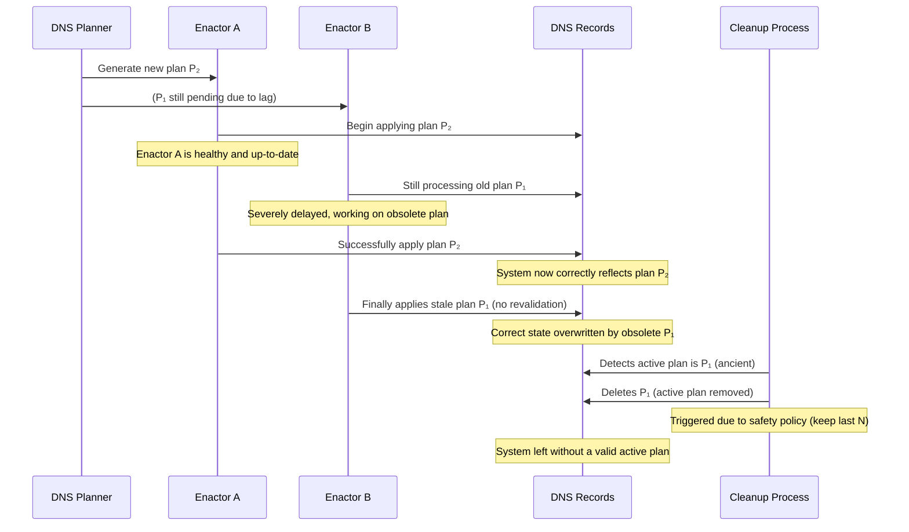
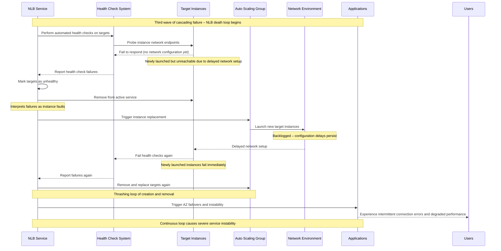

# Introduction

On the morning of October 20, 2025 awoke to a huge portion of the internet going dark. Millions of users couldn't reach their favorite apps-from Snapchat and Roblox to Signal and Duolingo to smart home devices like Alexa and Ring that fell silent. The cause was a catastrophic, multi-hour outage in Amazon Web Services' (AWS) Northern Virginia (`us-east-1`) region, the invisible backbone of the digital world[^guardian].

This was no straightforward e.g. hardware failure, but rather a complex, cascading connected system one that could best be comprehended in terms of aviation's "Swiss Cheese Model."

That initial "hole" created a cascading reaction that coupled with other systemic weaknesses to produce secondary and tertiary failures of core AWS services. Most critically, the recovery process itself-a final, solid barrier if there ever were one-acted as another "hole."

This alignment of flaws is what allowed the failure to cascade so greatly, making it one of the most significant disruptions since the CrowdStrike incident of 2024.

**Table: Consolidated Timeline of the US-EAST-1 Outage (October 20, 2025)** [^outage-live]

| Time (UTC) | Event Description | Key Services Affected |
| :--- | :--- | :--- |
| ~06:49 | First signs of trouble; DynamoDB API error rates. The root cause, a DNS race condition, occurs. | DynamoDB |
| ~07:11 | Outage reports begin as services dependent on DynamoDB start failing. | Snapchat, Venmo, Ring, Fortnite |
| ~09:24 | AWS fixes the core DNS issue, manually restoring the correct DNS record for DynamoDB. | DynamoDB |
| 09:24 - 12:28 | Phase 2 begins: DynamoDB's recovery triggers a "thundering herd" of requests, overwhelming the EC2 control plane (DWFM) and causing a "congestive collapse." | EC2 |
| ~12:28 | EC2's DropletWorkflow Manager (DWFM) recovers from congestive collapse after extensive manual intervention by AWS engineers. | EC2 |
| 12:28 onwards | Phase 3 begins: Recovery of EC2 launches creates a massive backlog in the Network Manager, leading to network configuration delays for new instances. | EC2 Networking |
| After 12:28 | Phase 4 begins: Network configuration delays cause mass health check failures in the Network Load Balancer (NLB), leading to "thrashing" and instability. | Network Load Balancer (NLB) |
| ~22:01 | AWS reports that all services have returned to normal operations, approximately 15 hours after the initial incident. | All affected services |

## Hole 0: A Race Condition in DNS Automation

The 14-hour outage didn't have its origin in a data center fire or fiber optic cable failure, but in a small timing-dependent flaw within the sophisticated automation system. Understanding the failure requires understanding the architecture of the DNS management system for DynamoDB, a service operating at such a scale as to make the use of static IP addresses impossible to consider.

DynamoDB's DNS system is designed to adapt constantly and automatically; it comprises two major components :

1. The DNS Planner: A process that continuously monitors the system load and the health of the underlying infrastructure. Periodically, it comes up with a new "plan"; a set of instructions detailing how DNS records should be configured to route traffic optimally.
2. The DNS Enactors: A fleet of independent agents that run in multiple AZs. They exist solely to take the latest plan from the Planner and apply it as a transaction against AWS's DNS service, Route 53. Their independence is by design.

This high-availability architecture had a latent bug, a classic race condition. The exact sequence of events that resulted in the first failure was as follows:

## Hole 1: The unreachable core infrastructure

The deletion of DynamoDB's DNS record was the event that triggered the entire regional failure. The impact was significant because DynamoDB is not just a customer-facing database; it is a core service that AWS uses widely to build and run other important services. A practice, referred to as "dogfooding," means that the control systems for key services like EC2, Lambda, and Network Manager depend heavily on DynamoDB's availability.

With the DNS records missing, any system trying to connect to DynamoDB in `us-east-1` started to face DNS resolution failures. This impacted not only customer applications but also, more importantly, AWS's internal management systems. The DynamoDB service itself stayed healthy and operational during this time; its servers were running, but they were completely unreachable, an isolated entity disconnected from the rest of the cloud.

This initial phase of the outage lasted about 2.5 hours, from the DNS record deletion at 06:49 UTC until AWS engineers could manually step in and restore the correct DNS entries at 09:24 UTC. During this period, the failure of a single logical component—a DNS entry for one critical service—was enough to disrupt the control system for the entire `us-east-1` region, leading to a much worse secondary crisis.

## Hole 2: Collapse of EC2's "brain" - DWFM

The moment engineers manually restored DynamoDB's DNS record at 09:24 UTC, the outage shifted from being unavailable to its most serious and prolonged phase. This restoration triggered every client, which had been unable to connect for the past 2.5 hours, to retry their requests at the SAME time.

This large, synchronized wave of retries is a common pattern in distributed systems failure known as the "thundering herd" problem. While many customer applications took part in this "stomping", the most important player was AWS's own EC2 control plane, specifically a system called the DropletWorkflow Manager (DWFM).

The DWFM is the brain of EC2. It manages the state, health, and leases of the physical servers - internally known as "droplets", which run all customer EC2 instances. It keeps a lease with each droplet, using DynamoDB as the backend. These leases act as a heartbeat mechanism. During the 2.5-hour DynamoDB outage, the DWFM could not renew these leases, leading to hundreds of thousands of them expiring across the region. When DynamoDB became accessible again, the DWFM was immediately overwhelmed by a huge backlog of lease renewal requests from every droplet in the region, far exceeding its normal capacity.

The DWFM was not built to handle such a large, correlated recovery event and was quickly was operating above its limits. It entered a state of "congestive collapse."

Congestive collapse happens when a system becomes so overwhelmed by its work queue, retries, and timeouts that its output, or "goodput," drops close to zero, even though it uses 100% of its resources[^congestive]. The DWFM was processing the backlog of lease renewals so slowly that new lease timeouts happened faster than old ones could be cleared. It was stuck, completely gridlocked by its struggle to recover.

This collapse in the EC2 control plane lasted nearly 11 hours after the initial DNS fix. The only way to break the cycle required AWS engineers to perform extensive manual work. This likely involved throttling traffic to the DWFM, restarting components to clear their work queues, and carefully bringing the system back online gradually. This phase of the crisis finally ended around 12:28 PM UTC, but the damage had spread further down the stack.

## Hole 3: Load Balancer Death Loop

Because the DWFM could not process instance launches for hours, a huge backlog of pending network configuration changes built up in a downstream system, the EC2 Network Manager. This system handles tasks like attaching network interfaces (ENIs) and applying Virtual Private Cloud (VPC) routing rules to new instances.

Once the DWFM started recovering and tackling its launch backlog, the Network Manager became completely swamped. This caused a strange and frustrating situation for customers. New EC2 instances would launch and show up in the "running" state, but they would lack network connectivity for a long time. They essentially became "zombie" instances—alive but isolated and ineffective.

This delay in network configuration set off the third and final hole of the cascading failure, this time in the Network Load Balancer (NLB) service. The sequence created a damaging feedback loop, or "death loop."

To stop the bleeding, AWS engineers had to manually intervene once again, this time by disabling the automatic health check failovers. This broke the destructive loop, allowing the network configuration backlog to clear and the environment to stabilize before the automation was carefully re-enabled.

## Summary

The technical debacle that unfolded due to a DNS record not being there had justifiable real-world consequences that were immediate and vast. As evidence, Downdetector charted user outage reports of over 17 million from globally, a degree of outages representing an increase of 970% over a daily average baseline. Moreover, outages were traced to over 3,500 unique companies across more than 60 countries.[^impact]

This incident is a strong reminder that as our technological systems evolve, so do the complexities of their failure modes, which become more subtle and more catastrophic. The ultimate takeaway is that in the hyperscale cloud era, resilience is not the absence of failure. Resilience is the capacity to contain the blast radius of a failure and, most importantly, ensure that the recovery process is itself a phenomenal and tested system, and that it accounted for the upkeep of the whole while it cared for the parts.

**Table: The Cascading Failure Chain; A Visual Summary**

| Phase | Triggering Event            | Affected System                 | Failure Mechanism                                                                                   | Consequence                                                                 |
|-------|-----------------------------|---------------------------------|-----------------------------------------------------------------------------------------------------|------------------------------------------------------------------------------|
| 1     | Latent Software Bug         | DynamoDB DNS Automation         | Race Condition between independent "Enactors"                                                      | DNS record for the regional endpoint becomes empty.                         |
| 2     | Restoration of DNS          | EC2 Control Plane (DWFM)        | "Thundering Herd" of lease renewals overwhelms the system, causing "Congestive Collapse."           | EC2 instance launches and state changes fail for ~11 hours.                 |
| 3     | Recovery of EC2 Launches    | EC2 Network Manager             | Massive work queue from the EC2 backlog overwhelms the network configuration system.                | New EC2 instances launch without network connectivity ("zombie" instances). |
| 4     | Network Configuration Backlog | Network Load Balancer (NLB)   | Mass health check failures on "zombie" instances trigger a destructive failover loop.               | "Thrashing" of network targets, causing widespread connection errors and instability. |

[^guardian]: Amazon Web Services outage shows internet users at mercy of too few providers [Guardian article](https://www.theguardian.com/technology/2025/oct/20/amazon-web-services-aws-outage-hits-dozens-websites-apps)
[^outage-live]: AWS was down - live updates [tomsguide](https://www.tomsguide.com/news/live/amazon-outage-october-2025)
[^congestive]: Surviving overloads: How Amazon Prime Day avoids congestion collapse [AWS re:Invent 2023](https://www.youtube.com/watch?v=fOYOvp6X10g)
[^impact]: Revealing the Cascading Impacts of the AWS Outage [Ookla report](https://www.ookla.com/articles/aws-outage-q4-2025)